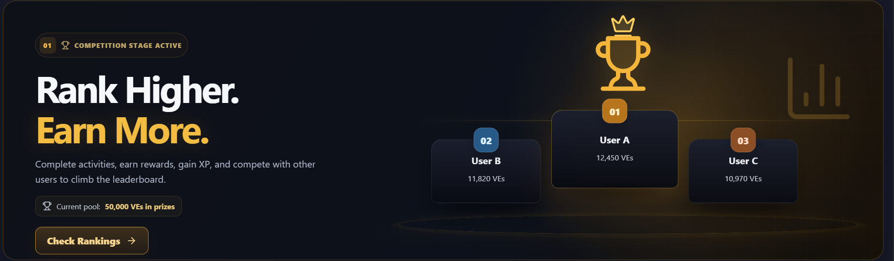
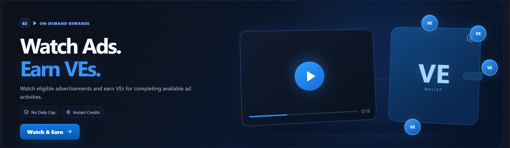
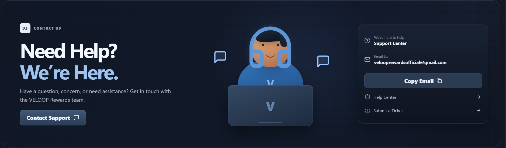
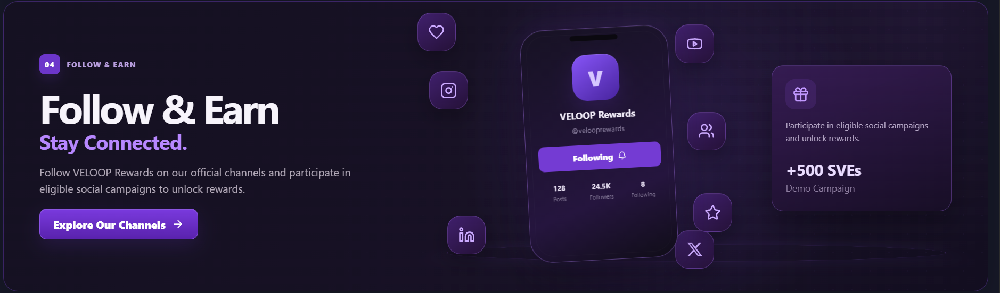
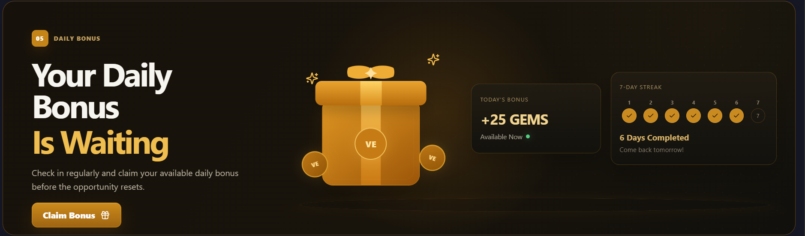

# VELOOP Rewards – Task 0G

Premium React/Vite implementation of the five VELOOP Rewards engagement utility banners from the assigned frontend task.

## Included banners

1. Leaderboard — competition, podium, trophy, rank cards and prize pool
2. Watch Ads & Earn — video player, VE wallet, reward coins and CTA
3. Contact Us — support agent, email copy interaction, help center and ticket links
4. Follow & Earn — social profile phone, channel icons and eligible campaign reward card
5. Daily Bonus — reward gift, available bonus card and seven-day streak

## Design requirements implemented

- Application body background: `#161827`
- 100% available-width banners
- Premium dark fintech/rewards visual language
- Distinct theme for every feature
- Large visual composition in every banner
- Purposeful lightweight animations
- High-contrast CTAs with hover, active and keyboard focus states
- Responsive layouts for desktop, tablet and mobile
- Touch-friendly actions (44px minimum on mobile where interactive)
- Reduced-motion accessibility support
- Dummy development reward data only

## Responsive target matrix

| Viewport category | Banner target                                   |
| ----------------- | ----------------------------------------------- |
| Laptop / Desktop  | 438px height, full-width split layout           |
| Tablet            | 500–530px height, adaptive split/stacked layout |
| Mobile            | 518–520px height, vertical composition          |

CSS has dedicated behavior around 1099px, 879px, 767px and 360px to protect typography, visual prominence, touch targets and overflow on narrow screens.

## Tech stack

- React.js
- Vite
- Bootstrap
- CSS Modules
- React Hooks
- Lucide React
- React Icons
- React Router DOM

## Folder structure

```text
src/
├── components/
│   ├── LeaderboardBanner/
│   ├── WatchAdBanner/
│   ├── ContactBanner/
│   ├── FollowEarnBanner/
│   ├── DailyBonusBanner/
│   └── FeaturePage/
├── data/
├── pages/
└── styles/
```

## Installation

```bash
npm install
npm run dev
```

Open the Vite local URL shown in the terminal.

## Production build

```bash
npm run build
npm run preview
```

## Interactions

- Animated trophy / floating leaderboard composition
- Video player float and VE coin movement
- Working support email copy button with feedback state
- Floating social icons and profile-phone motion
- Gift and sparkle animation for daily rewards
- CTA navigation to dedicated routes
- Visible keyboard focus states
- `prefers-reduced-motion` support

## Live Demo

https://veloop-rewards-task-0g.vercel.app

## GitHub Repository

https://github.com/yogeshr9530/veloop-rewards-task-0g

## Deployment

### Vercel

This project includes `vercel.json` with an SPA rewrite so React routes do not show a 404 when opened or refreshed directly.

1. Push the project to GitHub.
2. Import the repository into Vercel.
3. Framework preset: Vite.
4. Build command: `npm run build`.
5. Output directory: `dist`.
6. Deploy and verify `/leaderboard`, `/watch-earn`, `/contact`, `/follow-earn` and `/daily-bonus`.

### Netlify

`netlify.toml` and `public/_redirects` are included for SPA routing.

## Final testing checklist

- [x] Desktop: 1440px / 1366px
- [x] Tablet: 1024px / 768px
- [x] Mobile: 430px / 390px / 360px / 320px
- [x] No horizontal overflow
- [x] No clipped heading, illustration or CTA
- [x] All CTA routes work
- [x] Copy Email works
- [x] Keyboard tab + focus states work
- [x] Animations are smooth
- [x] Browser console has no errors
- [x] `npm run build` completes successfully
- [x] GitHub repo is public/accessible as required
- [x] Vercel or Netlify live URL works

## Screenshots

### Leaderboard



### Watch Ads & Earn



### Contact Us



### Follow & Earn



### Daily Bonus



## Demo data notice

Leaderboard values, reward amounts and streak information are development placeholders. Replace them only with approved production rules/data when backend integration becomes available.

## Author

Yogesh Rathor
